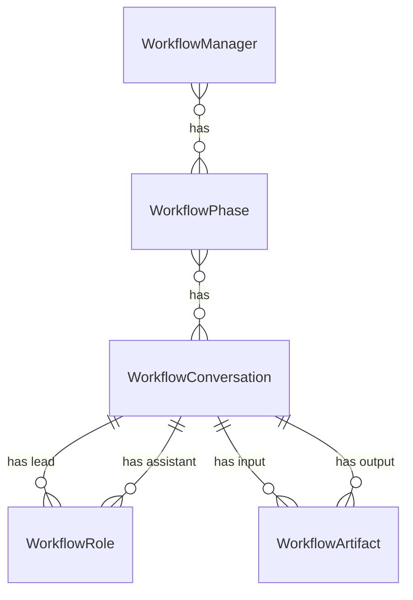

```mermaid
erDiagram
    WorkflowRole 
    WorkflowArtifact
    WorkflowConversation
    WorkflowPhase
    WorkflowManager

    WorkflowConversation ||--o{ WorkflowRole : "has lead"
    WorkflowConversation ||--o{ WorkflowRole : "has assistant"
    WorkflowConversation ||--o{ WorkflowArtifact : "has input"
    WorkflowConversation ||--o{ WorkflowArtifact : "has output"

    WorkflowPhase }o--o{ WorkflowConversation: "has"
    WorkflowManager }o--o{ WorkflowPhase: "has"
```
