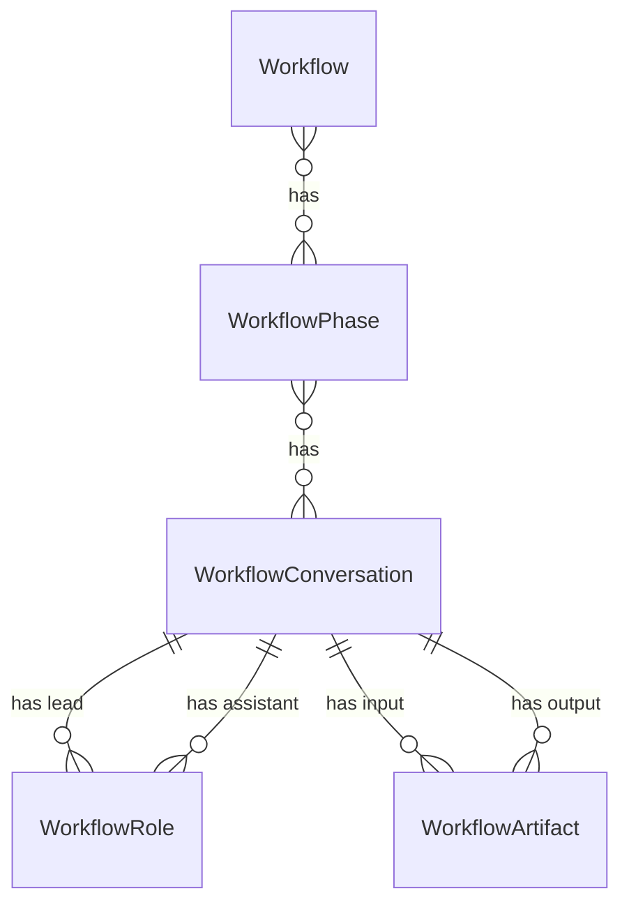
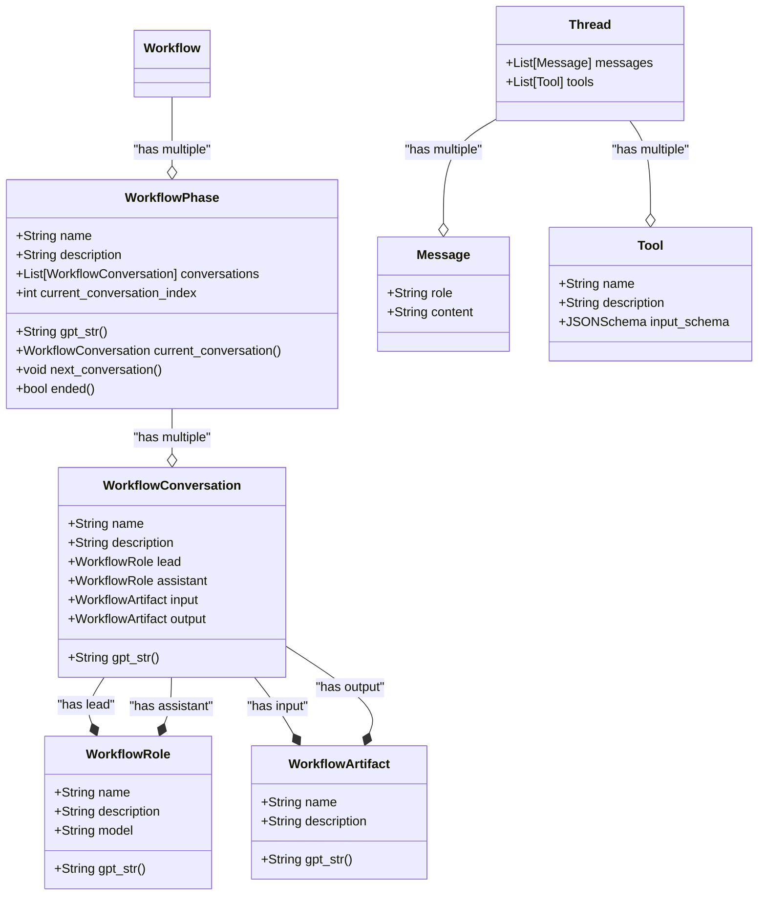

```mermaid
erDiagram
    WorkflowRole 
    WorkflowArtifact
    WorkflowConversation
    WorkflowPhase
    Workflow

    WorkflowConversation ||--o{ WorkflowRole : "has lead"
    WorkflowConversation ||--o{ WorkflowRole : "has assistant"
    WorkflowConversation ||--o{ WorkflowArtifact : "has input"
    WorkflowConversation ||--o{ WorkflowArtifact : "has output"

    WorkflowPhase }o--o{ WorkflowConversation: "has"
    Workflow }o--o{ WorkflowPhase: "has"
```

```mermaid
classDiagram

    class WorkflowRole {
        +String name
        +String description
        +String model
        +String gpt_str()
    }

    class WorkflowArtifact {
        +String name
        +String description
        +String gpt_str()
    }

    class WorkflowConversation {
        +String name
        +String description
        +WorkflowRole lead
        +WorkflowRole assistant
        +WorkflowArtifact input
        +WorkflowArtifact output
        +String gpt_str()
    }

    class WorkflowPhase {
        +String name
        +String description
        +List[WorkflowConversation] conversations
        +int current_conversation_index
        +String gpt_str()
        +WorkflowConversation current_conversation()
        +void next_conversation()
        +bool ended()
    }

    class Thread {
        +List[Message] messages
        +List[Tool] tools
    }

    class Message {
        +String role
        +String content
    }

    class Tool {
        +String name
        +String description
        +JSONSchema input_schema
    }

    WorkflowConversation --* WorkflowRole : "has lead"
    WorkflowConversation --* WorkflowRole : "has assistant"
    WorkflowConversation --* WorkflowArtifact : "has input"
    WorkflowConversation --* WorkflowArtifact : "has output"

    WorkflowPhase --o WorkflowConversation : "has multiple"
    Workflow --o WorkflowPhase : "has multiple"

    Thread --o Message : "has multiple"
    Thread --o Tool : "has multiple"
```
